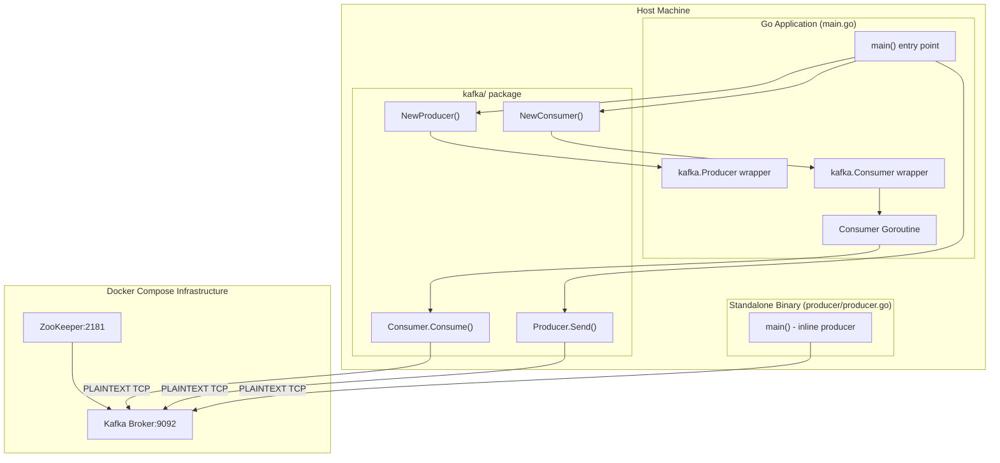
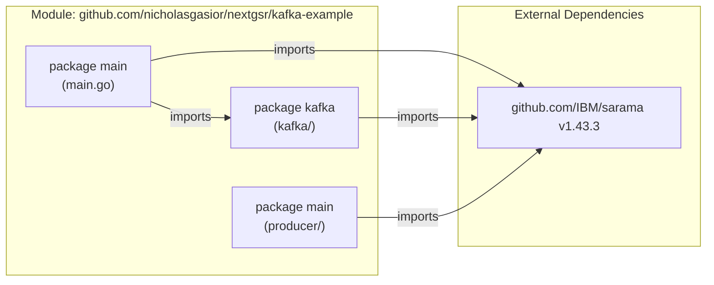
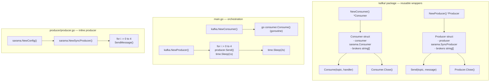
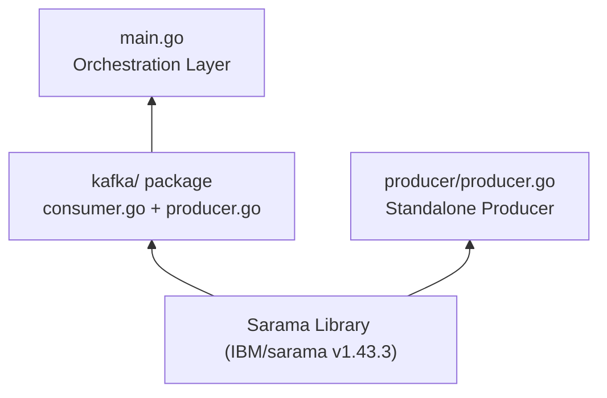

# Architecture

## System Architecture Overview

The kafka-example project is a **single-node, dual-binary Go application** that exercises the Apache Kafka messaging paradigm locally. There are two runnable binaries: the main combined demo (`main.go`) and a standalone producer (`producer/producer.go`). All Kafka broker and ZooKeeper infrastructure is provided via Docker Compose.

---

## Package / Module Diagram

---

## Component Breakdown

---

## Layer Dependency View

