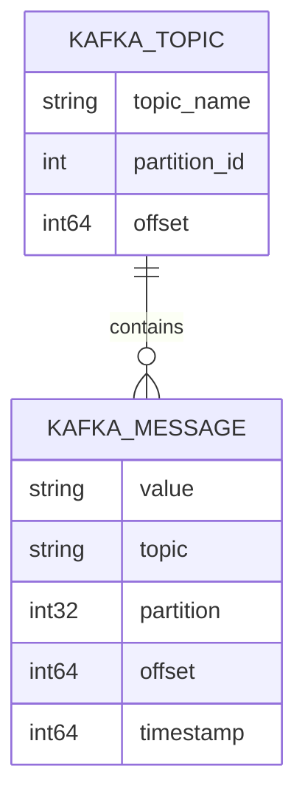
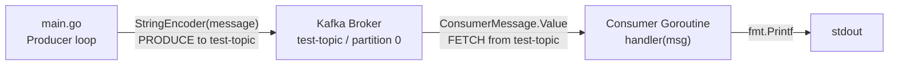

# Database & Data Layer

## Overview

This project has **no traditional database, ORM, or persistent storage layer**. All data flows exclusively through Apache Kafka topics in-memory as part of a transient messaging demonstration. There are no SQL schemas, NoSQL collections, migration scripts, or file-based storage concerns.

The data model is minimal: plain UTF-8 string messages are produced and consumed.

---

## Message Data Model

Kafka messages in this project use the simplest possible structure — no schema registry, no Avro/Protobuf serialization, just raw string values.



> **Note:** The above is a logical representation of Kafka's message structure as used by the Sarama `ConsumerMessage` and `ProducerMessage` types. There is no physical database schema.

---

## Message Payload Format

The producer constructs messages with the following string template:

```
"Hello, Kafka! Message {i}"   where i = 0, 1, 2, 3, 4
```

The `sarama.StringEncoder` is used to encode the plain string directly as the Kafka message `Value` bytes. No key, headers, or metadata are set.

---

## Kafka Topic Configuration

| Property | Value |
|---|---|
| Topic Name | `test-topic` |
| Partitions Consumed | Partition `0` only |
| Starting Offset | `sarama.OffsetNewest` (only new messages) |
| Replication Factor | `1` (single broker, local dev) |
| Producer Acknowledgement | Synchronous (`SyncProducer`) |

---

## Data Flow Diagram



---

## State Management

The application is **stateless** beyond the lifetime of a single process run:

- Consumer offset is not persisted (uses `OffsetNewest`, so it only sees messages sent after it starts).
- No consumer group is registered; a raw partition consumer is used.
- All data is ephemeral — restarting the broker or application loses all messages.
