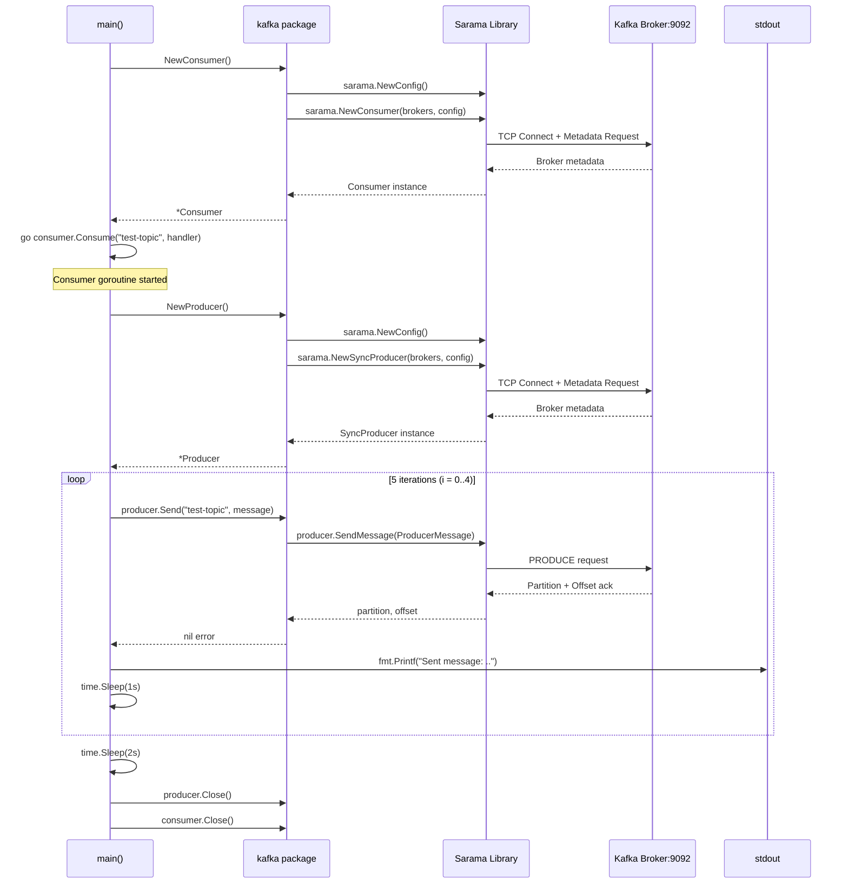
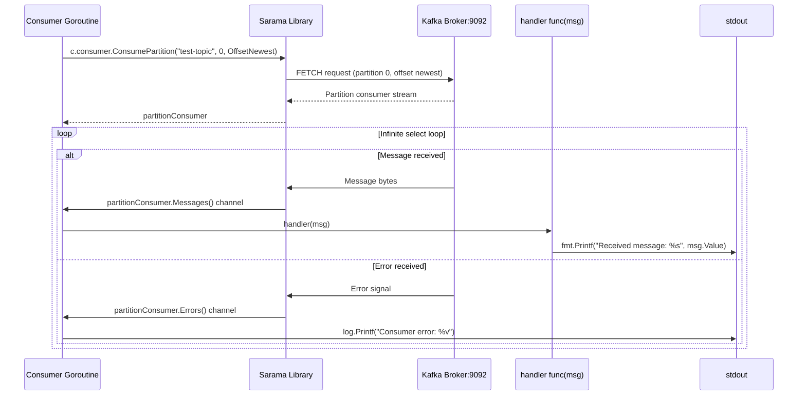
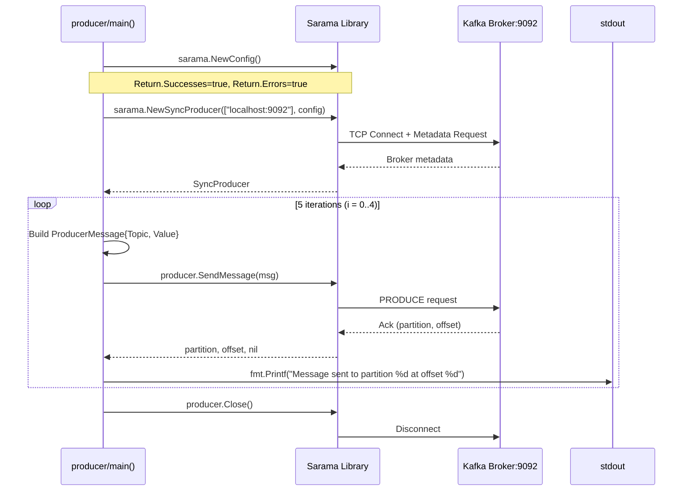
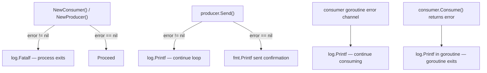
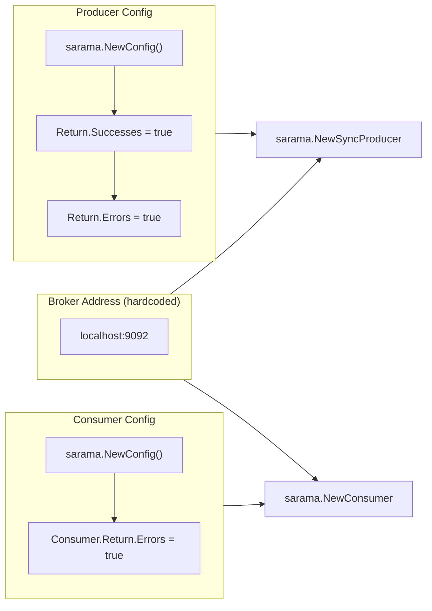

# Technical Flows

## 1. Application Startup Flow (main.go)

---

## 2. Consumer Goroutine Message Processing Flow

---

## 3. Standalone Producer Flow (producer/producer.go)

---

## 4. Error Handling Flow

---

## 5. Configuration Flow

