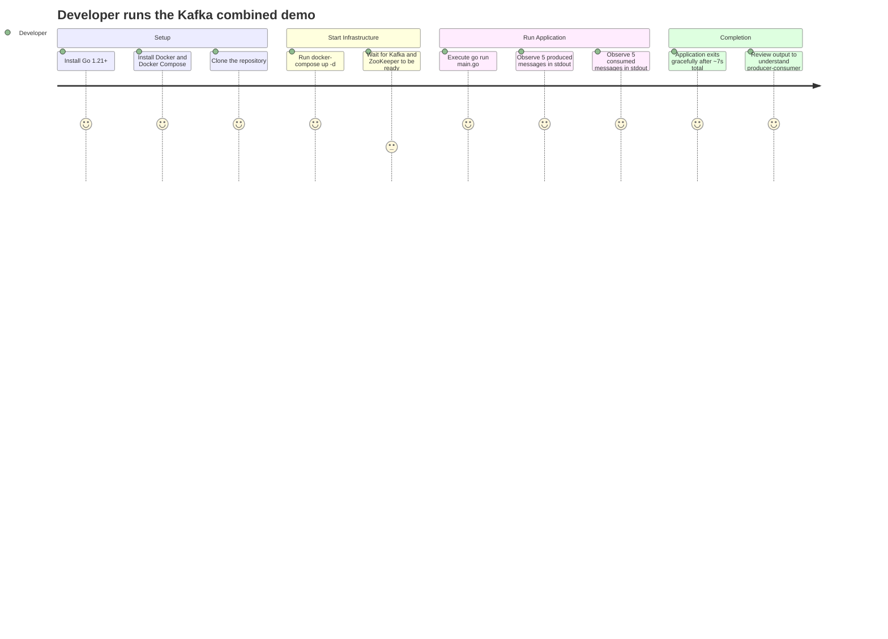
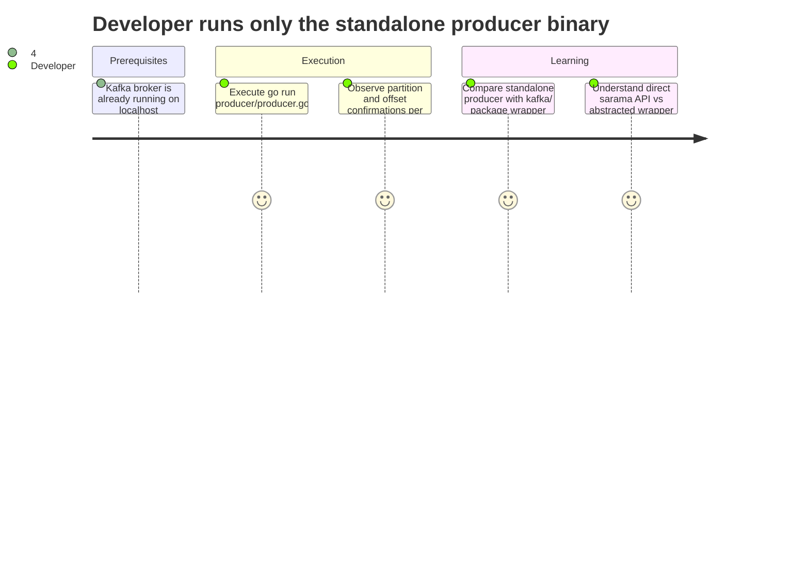
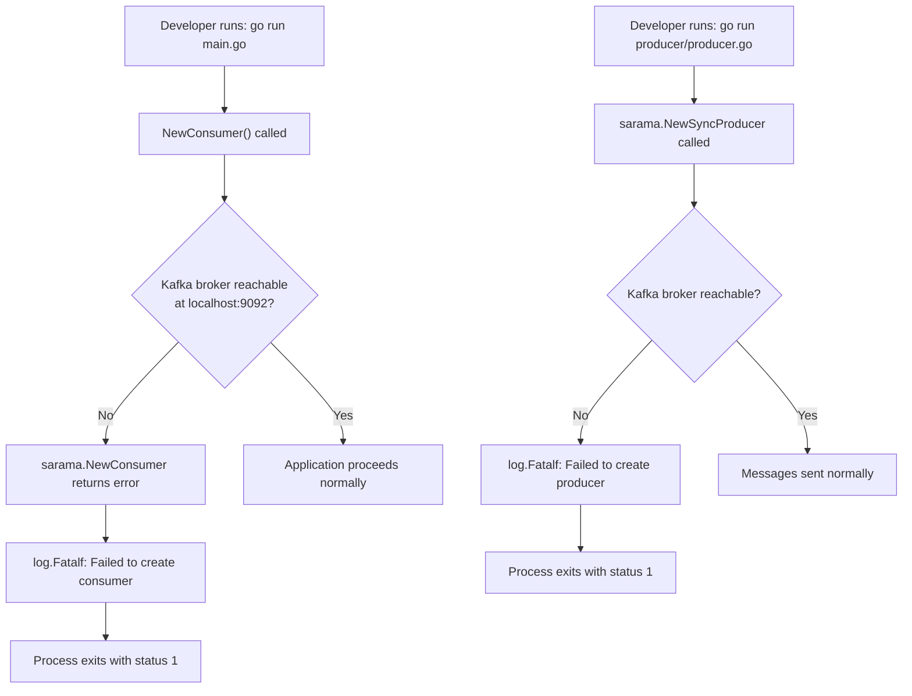
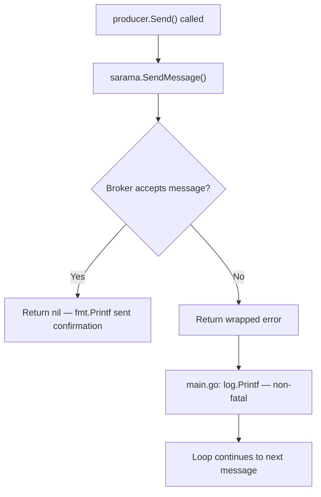
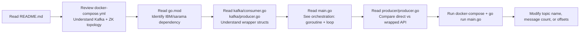

# User Journeys

## Overview

This is a developer-facing CLI application. There are no end-users or UI components. The "users" are Go developers learning Kafka fundamentals or running local integration tests. The journeys below reflect the developer experience of running the application.

---

## Primary Journey: Run the Combined Demo (main.go)

---

## Secondary Journey: Run the Standalone Producer

---

## Error Journey: Kafka Broker Not Available

---

## Error Journey: Message Send Failure

---

## Developer Learning Journey: Understanding the Codebase

