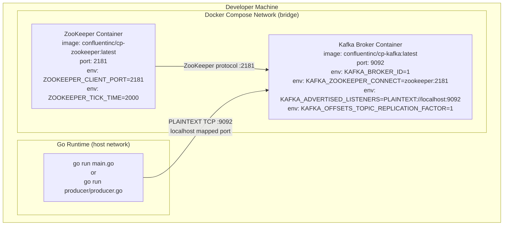
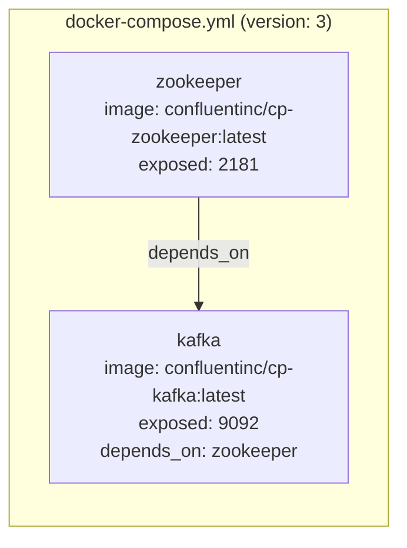
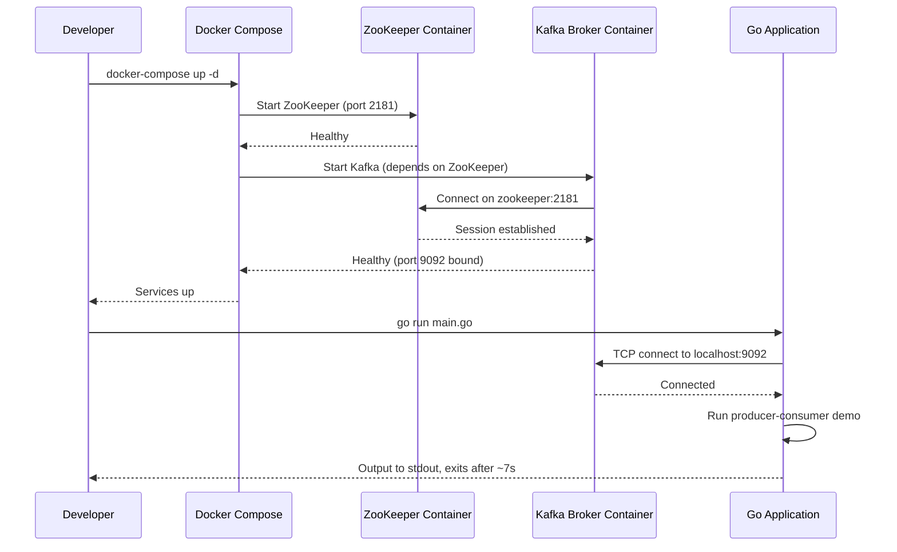
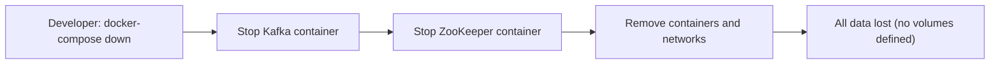

# Deployment

## Overview

This is a **local development / educational project** with no production deployment pipeline. Infrastructure is entirely managed via Docker Compose for local execution. There is no CI/CD configuration, container registry, Kubernetes manifests, or cloud provider configuration in the repository.

---

## Local Deployment Architecture

---

## Docker Compose Service Map

---

## Startup Sequence

---

## Teardown

> **Note:** The Docker Compose configuration defines **no named volumes**, so all Kafka topic data and offsets are lost when containers are stopped.

---

## Environment Configuration

| Parameter | Value | Location |
|---|---|---|
| Kafka Broker Address | `localhost:9092` | Hardcoded in Go source files |
| ZooKeeper Port | `2181` | `docker-compose.yml` |
| Kafka Port | `9092` | `docker-compose.yml` |
| Kafka Broker ID | `1` | `docker-compose.yml` |
| Replication Factor | `1` | `docker-compose.yml` env |
| Topic Name | `test-topic` | Hardcoded in `main.go` |
| Consumer Partition | `0` | Hardcoded in `kafka/consumer.go` |
| Consumer Start Offset | `OffsetNewest` | Hardcoded in `kafka/consumer.go` |

> All configuration is hardcoded. There is no `.env` file, environment variable injection, or configuration management layer.

---

## CI/CD Pipeline

**No CI/CD pipeline is configured in this repository.** There are no:
- GitHub Actions workflows
- GitLab CI files
- Jenkinsfiles
- Makefile build targets
- Dockerfiles for the Go application itself
- Container registry pushes

The project is intended to be run manually by developers for learning purposes.

---

## Production Readiness Notes

This project is explicitly a **development example**, not production-ready code. For production deployment, the following would need to be addressed:

| Gap | Production Recommendation |
|---|---|
| Hardcoded broker address | Inject via environment variable or config file |
| No consumer group | Use `sarama.ConsumerGroup` for scalable consumption |
| OffsetNewest only | Persist consumer group offsets to Kafka |
| Single partition | Design for multi-partition topics |
| No TLS/SASL | Enable TLS and SASL authentication for Kafka connections |
| No health checks | Add readiness/liveness probes if containerized |
| No metrics export | Expose `rcrowley/go-metrics` data to Prometheus |
| Single broker | Use a multi-broker Kafka cluster with replication |
