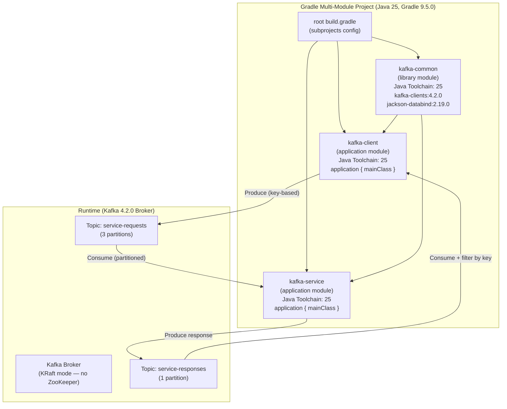
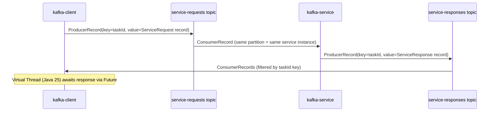

```
  ███████╗ █████╗ ███████╗██╗   ██╗ █████╗ 
  ██╔════╝██╔══██╗██╔════╝██║   ██║██╔══██╗
  ███████╗███████║███████╗██║   ██║███████║
  ╚════██║██╔══██║╚════██║╚██╗ ██╔╝██╔══██║
  ███████║██║  ██║███████║ ╚████╔╝ ██║  ██║
  ╚══════╝╚═╝  ╚═╝╚══════╝  ╚═══╝  ╚═╝  ╚═╝
```

> *Plan generated by SASVA AI*

---

# Java 11 → Java 25 Upgrade Plan

## Executive Summary

This plan upgrades a 3-module Gradle Kafka Producer/Consumer demo project from **Java 11 to Java 25 (LTS)**. Based on investigation findings and your chosen preferences, the upgrade covers:

- **1A**: Java 25 Toolchain declared per-module via `java { toolchain { languageVersion = JavaLanguageVersion.of(25) } }`
- **2B**: Gradle Wrapper added and pinned to **Gradle 9.5.0** (latest stable, fully Java 25 compatible)
- **3A**: All dependencies upgraded to latest stable versions compatible with Java 25
- **4A**: Deprecated `mainClassName` replaced with `application { mainClass = '...' }` in both app modules
- **5C**: Full source code modernization — records, virtual threads, lambdas, `List.of()`, and pattern matching

Java 25 was released on **September 16, 2025** and is a **Long-Term Support (LTS)** release. Gradle 9.1.0+ is required for Java 25 toolchain support; this plan uses **Gradle 9.5.0**.

---

## 📊 Project Metrics

| Metric | Value |
|---|---|
| Gradle submodules | 3 (`kafka-common`, `kafka-client`, `kafka-service`) |
| Total Java source files | 10 |
| Test files | 1 (`BasicTests.java`) |
| `build.gradle` files to modify | 4 (root + 3 submodules) |
| New files to create | 4 (Gradle wrapper: `gradlew`, `gradlew.bat`, `gradle-wrapper.jar`, `gradle-wrapper.properties`) |
| Source files requiring modernization | 7 |
| CI/CD pipelines | 0 (none found) |
| Dockerfiles | 0 (none found) |

---

## 📁 Project Structure

```
kafka-producer-consumer/
├── build.gradle                          ← Root build (modify: add subprojects toolchain block)
├── settings.gradle                       ← No change needed
├── README.md                             ← Update build/run instructions
├── gradle/
│   └── wrapper/
│       ├── gradle-wrapper.jar            ← NEW (generated)
│       └── gradle-wrapper.properties     ← NEW (Gradle 9.5.0)
├── gradlew                               ← NEW (generated)
├── gradlew.bat                           ← NEW (generated)
├── kafka-common/
│   ├── build.gradle                      ← Modify: toolchain + dependency upgrades
│   └── src/main/java/itx/examples/kafka/
│       ├── KafkaConstants.java           ← No change
│       ├── ProcessingException.java      ← No change
│       ├── ProcessingService.java        ← No change
│       ├── DataMapper.java               ← Minor modernization
│       ├── SingleRecordConsumerJob.java  ← Modernize: List.of(), pattern matching
│       └── dto/
│           ├── ServiceRequest.java       ← Modernize: convert to record
│           └── ServiceResponse.java      ← Modernize: convert to record
├── kafka-client/
│   ├── build.gradle                      ← Modify: toolchain + deps + mainClass fix
│   └── src/main/java/itx/examples/kafka/client/
│       ├── ClientApp.java                ← Modernize: update record accessors
│       ├── Arguments.java                ← No change (JCommander needs mutable fields)
│       └── ProcessingServiceClient.java  ← Modernize: virtual threads, List.of()
│   └── src/test/java/itx/examples/kafka/client/tests/
│       └── BasicTests.java              ← Modernize: update record accessor calls
└── kafka-service/
    ├── build.gradle                      ← Modify: toolchain + deps + mainClass fix
    └── src/main/java/itx/examples/kafka/service/
        ├── ServiceApp.java               ← Modernize: lambda shutdown hook
        ├── Arguments.java                ← No change (JCommander needs mutable fields)
        └── ProcessingServiceBackend.java ← Modernize: List.of(), record accessors
```

---

## 🔧 Tech Stack — Current vs Target

| Component | Current Version | Target Version | Notes |
|---|---|---|---|
| **Java** | 11 | **25** | LTS, released Sep 16, 2025 |
| **Gradle** | Unknown (no wrapper) | **9.5.0** | Minimum 9.1.0 for Java 25 |
| `kafka-clients` | 2.5.1 | **4.2.0** | Built & tested with Java 25 |
| `kafka-streams` | 2.5.1 | **4.2.0** | Built & tested with Java 25 |
| `jackson-databind` | 2.11.2 | **2.19.0** | Native record support since 2.12 |
| `jcommander` | 1.78 | **1.82** | Latest stable |
| `testng` | 7.3.0 | **7.10.2** | Latest stable, Java 25 compatible |
| `sourceCompatibility` | `= 11` | **removed** | Replaced by toolchain |
| `targetCompatibility` | `= 11` | **removed** | Replaced by toolchain |

---

## 🏗️ Architecture Diagram



---

## 🔄 Data Flow Diagram



---

## 📦 Dependency Upgrade Details

### kafka-clients & kafka-streams: `2.5.1` → `4.2.0`

| Change | Impact |
|---|---|
| **Kafka 4.x drops ZooKeeper** (KRaft only) | Broker setup change only — no client code change |
| `KafkaProducer`, `KafkaConsumer` API | Backward compatible — no source changes needed |
| `org.apache.kafka.common.utils.Bytes` | Still present — no source changes needed |
| `ProducerRecord`, `ConsumerRecord`, `ConsumerRecords` | Backward compatible |
| `Consumer` interface | Backward compatible |

### jackson-databind: `2.11.2` → `2.19.0`

| Change | Impact |
|---|---|
| **Native Java Record support** (since 2.12) | `@JsonCreator`/`@JsonProperty` can be removed from records |
| No breaking API changes for existing usage | `ObjectMapper`, `readValue`, `writeValueAsBytes` unchanged |

### jackson-core & jackson-annotations | Included transitively via `jackson-databind:2.19.0`

### testng: `7.3.0` → `7.10.2`

| Change | Impact |
|---|---|
| `@Test`, `Assert.assertEquals` API | Fully backward compatible — `BasicTests.java` logic unchanged |

### jcommander: `1.78` → `1.82`

| Change | Impact |
|---|---|
| `@Parameter` annotation | Fully backward compatible |
| `Arguments.java` classes | No changes required (JCommander still needs mutable class fields) |

---

## 🛠️ Build Configuration Changes (Detailed)

### Root `build.gradle` — Before
```groovy
subprojects {
    // existing content
}
```

### Root `build.gradle` — After
The root build already uses a `subprojects {}` block. The `sourceCompatibility`/`targetCompatibility` declarations are in each submodule's `build.gradle` and will be replaced with toolchain config there.

---

### `kafka-common/build.gradle` — Key Changes

```groovy
// REMOVE these two lines:
sourceCompatibility = 11
targetCompatibility = 11

// ADD Java Toolchain block:
java {
    toolchain {
        languageVersion = JavaLanguageVersion.of(25)
    }
}

// UPDATE dependencies:
dependencies {
    implementation 'com.fasterxml.jackson.core:jackson-databind:2.19.0'
    implementation 'org.apache.kafka:kafka-clients:4.2.0'
    testImplementation 'org.testng:testng:7.10.2'
}
```

---

### `kafka-client/build.gradle` — Key Changes

```groovy
// REMOVE:
mainClassName = 'itx.examples.kafka.client.ClientApp'
sourceCompatibility = 11
targetCompatibility = 11

// ADD:
application {
    mainClass = 'itx.examples.kafka.client.ClientApp'
}

java {
    toolchain {
        languageVersion = JavaLanguageVersion.of(25)
    }
}

// UPDATE dependencies:
dependencies {
    implementation project(':kafka-common')
    implementation 'org.apache.kafka:kafka-clients:4.2.0'
    implementation 'org.apache.kafka:kafka-streams:4.2.0'
    implementation 'com.beust:jcommander:1.82'
    testImplementation 'org.testng:testng:7.10.2'
}
```

---

### `kafka-service/build.gradle` — Key Changes

```groovy
// REMOVE:
mainClassName = 'itx.examples.kafka.service.ServiceApp'
sourceCompatibility = 11
targetCompatibility = 11

// ADD:
application {
    mainClass = 'itx.examples.kafka.service.ServiceApp'
}

java {
    toolchain {
        languageVersion = JavaLanguageVersion.of(25)
    }
}

// UPDATE dependencies:
dependencies {
    implementation project(':kafka-common')
    implementation 'org.apache.kafka:kafka-clients:4.2.0'
    implementation 'org.apache.kafka:kafka-streams:4.2.0'
    implementation 'com.beust:jcommander:1.82'
    testImplementation 'org.testng:testng:7.10.2'
}
```

---

### `gradle/wrapper/gradle-wrapper.properties` — New File

```properties
distributionBase=GRADLE_USER_HOME
distributionPath=wrapper/dists
distributionUrl=https\://services.gradle.org/distributions/gradle-9.5.0-bin.zip
networkTimeout=10000
validateDistributionUrl=true
zipStoreBase=GRADLE_USER_HOME
zipStorePath=wrapper/dists
```

> **Note:** Run `gradle wrapper --gradle-version=9.5.0` to also generate `gradlew`, `gradlew.bat`, and `gradle/wrapper/gradle-wrapper.jar`.

---

## ✨ Source Code Modernization Changes (5C — Full)

### 1. `ServiceRequest.java` → Convert to Java Record

**Before (Java 11 style):**
```java
public class ServiceRequest {
    private final String taskId;
    private final String clientId;
    private final String data;

    @JsonCreator
    public ServiceRequest(@JsonProperty("taskId") String taskId,
                          @JsonProperty("clientId") String clientId,
                          @JsonProperty("data") String data) { ... }

    public String getTaskId() { return taskId; }
    public String getData() { return data; }
    public String getClientId() { return clientId; }
}
```

**After (Java 25 record — Jackson 2.19.0 native record support):**
```java
package itx.examples.kafka.dto;

public record ServiceRequest(String taskId, String clientId, String data) {}
```
> Jackson 2.19.0 natively deserializes records using component names. No `@JsonCreator`/`@JsonProperty` needed.

---

### 2. `ServiceResponse.java` → Convert to Java Record

**After:**
```java
package itx.examples.kafka.dto;

public record ServiceResponse(String taskId, String clientId, String data, String response) {}
```

---

### 3. `ServiceApp.java` → Replace Anonymous Thread with Lambda

**Before:**
```java
Runtime.getRuntime().addShutdownHook(new Thread() {
    @Override
    public void run() {
        processingServiceBackend.shutdown();
    }
});
```

**After:**
```java
Runtime.getRuntime().addShutdownHook(
    new Thread(() -> processingServiceBackend.shutdown())
);
```

---

### 4. `ProcessingServiceClient.java` → Virtual Threads + `List.of()`

**Before:**
```java
this.executor = Executors.newSingleThreadExecutor();
// ...
Collection<String> topics = Collections.singletonList(TOPIC_SERVICE_RESPONSES);
```

**After:**
```java
// Java 21+ Virtual Threads — lightweight, OS-thread-free concurrency
this.executor = Executors.newVirtualThreadPerTaskExecutor();
// ...
// Java 9+ immutable list factory
var topics = List.of(TOPIC_SERVICE_RESPONSES);
```
> Remove `import java.util.Collections;`, add `import java.util.List;`

---

### 5. `ProcessingServiceBackend.java` → Record Accessors + `List.of()`

**Before:**
```java
Collection<String> topics = Collections.singletonList(TOPIC_SERVICE_REQUESTS);
// ...
ServiceResponse response = new ServiceResponse(
    request.getTaskId(), request.getClientId(), request.getData(), "response:" + request.getData());
LOG.info("Received Request: {}:{}:{}", record.key(), request.getClientId(), request.getTaskId());
```

**After:**
```java
var topics = List.of(TOPIC_SERVICE_REQUESTS);
// ...
var response = new ServiceResponse(
    request.taskId(), request.clientId(), request.data(), "response:" + request.data());
LOG.info("Received Request: {}:{}:{}", record.key(), request.clientId(), request.taskId());
```

---

### 6. `ClientApp.java` → Update Record Accessor Calls

**Before:**
```java
public static String checkResponse(ServiceRequest request, ServiceResponse response) {
    if (request.getTaskId().equals(response.getTaskId())
            && request.getClientId().equals(response.getClientId())
            && request.getData().equals(response.getData())) {
        return "OK";
    }
    return "ERROR";
}
```

**After (using record accessors + pattern matching for null safety):**
```java
public static String checkResponse(ServiceRequest request, ServiceResponse response) {
    return (request.taskId().equals(response.taskId())
            && request.clientId().equals(response.clientId())
            && request.data().equals(response.data()))
            ? "OK" : "ERROR";
}
```

Also update in `main()`:
```java
// Before:
ServiceRequest serviceRequest = new ServiceRequest(taskId, arguments.getClientId(),"hi[" + i + "]");
LOG.info("Request: {}:{}:{}", arguments.getClientId(), serviceRequest.getTaskId(), serviceRequest.getData());
// ...
LOG.info("Response[{}]: {}:{}:{} {} {}ms", i, serviceResponse.getTaskId(), serviceResponse.getData(), serviceResponse.getResponse(), eval, delay);

// After:
var serviceRequest = new ServiceRequest(taskId, arguments.getClientId(), "hi[" + i + "]");
LOG.info("Request: {}:{}:{}", arguments.getClientId(), serviceRequest.taskId(), serviceRequest.data());
// ...
LOG.info("Response[{}]: {}:{}:{} {} {}ms", i, serviceResponse.taskId(), serviceResponse.data(), serviceResponse.response(), eval, delay);
```

---

### 7. `ProcessingServiceClient.java` → Record Accessors

**Before:**
```java
Bytes bytes = dataMapper.serialize(request);
ProducerRecord<String, Bytes> record = new ProducerRecord<>(TOPIC_SERVICE_REQUESTS, request.getTaskId(), bytes);
```

**After:**
```java
var bytes = dataMapper.serialize(request);
var record = new ProducerRecord<>(TOPIC_SERVICE_REQUESTS, request.taskId(), bytes);
```

---

### 8. `SingleRecordConsumerJob.java` → `List.of()` (via subscribe is upstream, no direct change needed)

No direct `Collections.singletonList()` usage — no change needed here beyond confirming record deserialization still works with `dataMapper.deserialize(record.value(), ServiceResponse.class)`.

---

### 9. `BasicTests.java` → Update Record Accessor Calls

**Before:**
```java
ServiceRequest request = new ServiceRequest("taskid", "clientId","data");
ServiceResponse response = new ServiceResponse("taskid", "clientId", "data", "response");
String compare = ClientApp.checkResponse(request, response);
Assert.assertEquals(compare, "OK");
```

**After (no constructor change — records use same positional constructor):**
```java
// Constructor syntax is identical for records — no change needed there.
// But if the test ever accessed getters directly, those would need updating.
// The existing test is already correct as-is (no getter calls in test body).
var request = new ServiceRequest("taskid", "clientId", "data");
var response = new ServiceResponse("taskid", "clientId", "data", "response");
String compare = ClientApp.checkResponse(request, response);
Assert.assertEquals(compare, "OK");
```

---

## ⚠️ Migration Risks & Breaking Changes

| Risk | Severity | Mitigation |
|---|---|---|
| **Kafka 4.x drops ZooKeeper** — broker must run in KRaft mode | Medium | Update README broker setup instructions. Client code is unaffected. |
| **Record accessor names** — `getTaskId()` → `taskId()` | High | All call sites must be updated (covered in plan). 6 files affected. |
| **`mainClassName` removal** in Gradle 9 | High | Replaced with `application { mainClass = '...' }` as per 4A |
| **`Collections.singletonList()`** | Low | Compiles fine in Java 25 — replaced with `List.of()` for modernization |
| **Jackson record deserialization** | Medium | Jackson 2.19.0 natively supports records; `@JsonCreator` annotations removed |
| **Virtual threads** replacing `newSingleThreadExecutor` | Low | Drop-in API replacement; same `ExecutorService` interface |
| **Gradle 9 breaking changes** | Medium | `subprojects {}` and `apply plugin:` style still work in Gradle 9 with Groovy DSL |
| **SLF4J version mismatch** | Low | Kafka 4.x brings SLF4J 2.x transitively; add `slf4j-simple:2.0.x` if console output is needed |

---

## 🧪 Testing Strategy

| Aspect | Detail |
|---|---|
| Test framework | TestNG 7.10.2 (upgraded from 7.3.0) |
| Test file | `kafka-client/src/test/java/itx/examples/kafka/client/tests/BasicTests.java` |
| Test scope | Unit test — no Kafka broker required |
| Test validates | `ClientApp.checkResponse()` with `ServiceRequest` and `ServiceResponse` records |
| Run command | `./gradlew clean test` |
| Expected result | 1 test passes: `testResponseRequestCompare` |

> Integration testing (with live Kafka broker) requires a Kafka 4.x broker running in **KRaft mode** (no ZooKeeper). See updated README section below.

---

## 📖 README Updates Required

The README references Kafka 2.2.0/2.6.0 for broker setup with ZooKeeper. Update to:

1. **Kafka version**: Upgrade setup instructions to Kafka 4.x (KRaft mode — no ZooKeeper)
2. **Start broker**: Replace `zookeeper-server-start.sh` + `kafka-server-start.sh` with KRaft single-node setup:
   ```bash
   KAFKA_CLUSTER_ID="$(bin/kafka-storage.sh random-uuid)"
   bin/kafka-storage.sh format --standalone -t $KAFKA_CLUSTER_ID -c config/server.properties
   bin/kafka-server-start.sh config/server.properties
   ```
3. **Build command**: Change `gradle clean build` → `./gradlew clean build installDist distZip`
4. **Java requirement**: Update "Java 11" references to "Java 25"

---

## 🚀 Implementation Plan

### Phase 1: Gradle Wrapper & Build Infrastructure (0.5–1 hour)

**Goal:** Establish Gradle 9.5.0 as the project's pinned build tool.

**Tasks:**
- [ ] Install Gradle 9.5.0 locally (or use SDKMAN: `sdk install gradle 9.5.0`)
- [ ] Run `gradle wrapper --gradle-version=9.5.0` in project root to generate `gradlew`, `gradlew.bat`, `gradle/wrapper/gradle-wrapper.jar`, `gradle/wrapper/gradle-wrapper.properties`
- [ ] Verify wrapper works: `./gradlew --version` should show `Gradle 9.5.0`

---

### Phase 2: Build Script Upgrades (0.5–1 hour)

**Goal:** Update all 4 `build.gradle` files for Java 25 toolchain, fixed `mainClass`, and upgraded dependencies.

**Tasks:**
- [ ] In `kafka-common/build.gradle`: Remove `sourceCompatibility = 11` and `targetCompatibility = 11`; add `java { toolchain { languageVersion = JavaLanguageVersion.of(25) } }`; upgrade `jackson-databind` to `2.19.0`, `kafka-clients` to `4.2.0`, `testng` to `7.10.2`
- [ ] In `kafka-client/build.gradle`: Remove `mainClassName` and compatibility lines; add `application { mainClass = 'itx.examples.kafka.client.ClientApp' }`; add toolchain block; upgrade `kafka-clients` to `4.2.0`, `kafka-streams` to `4.2.0`, `jcommander` to `1.82`, `testng` to `7.10.2`
- [ ] In `kafka-service/build.gradle`: Remove `mainClassName` and compatibility lines; add `application { mainClass = 'itx.examples.kafka.service.ServiceApp' }`; add toolchain block; upgrade all dependencies same as above
- [ ] Run `./gradlew dependencies` to verify dependency resolution — confirm no conflicts
- [ ] Run `./gradlew clean build` — expect compilation errors due to record getter changes (fixed in Phase 4)

---

### Phase 3: DTO Modernization — Records (0.5 hour)

**Goal:** Convert `ServiceRequest` and `ServiceResponse` to Java 25 records.

**Tasks:**
- [ ] Replace `ServiceRequest.java` with a record: `public record ServiceRequest(String taskId, String clientId, String data) {}`
- [ ] Replace `ServiceResponse.java` with a record: `public record ServiceResponse(String taskId, String clientId, String data, String response) {}`
- [ ] Remove `import com.fasterxml.jackson.annotation.JsonCreator` and `import com.fasterxml.jackson.annotation.JsonProperty` from both files (no longer needed with Jackson 2.19.0)

---

### Phase 4: Source Code Modernization — All Modules (1–1.5 hours)

**Goal:** Update all call sites for record accessor names and apply full Java 25 modernization.

**Tasks:**
- [ ] Update `ClientApp.java`: Replace all `getTaskId()`, `getData()`, `getClientId()`, `getResponse()` calls with record accessors `taskId()`, `data()`, `clientId()`, `response()`; use `var` for local variables; modernize `checkResponse()` to ternary
- [ ] Update `ProcessingServiceClient.java`: Replace `Executors.newSingleThreadExecutor()` with `Executors.newVirtualThreadPerTaskExecutor()`; replace `Collections.singletonList()` with `List.of()`; update `request.getTaskId()` to `request.taskId()`; use `var` for local variable declarations
- [ ] Update `ProcessingServiceBackend.java`: Replace `Collections.singletonList()` with `List.of()`; update all `request.getClientId()`, `request.getTaskId()`, `request.getData()` calls to record accessors; use `var` for local variables
- [ ] Update `ServiceApp.java`: Replace anonymous `Thread` class with lambda `new Thread(() -> processingServiceBackend.shutdown())`
- [ ] Update `BasicTests.java`: Use `var` for local variable declarations (constructor calls remain identical for records)
- [ ] Remove all unused `import java.util.Collections` statements across affected files

---

### Phase 5: Verify Build & Tests (0.5 hour)

**Goal:** Confirm everything compiles and all tests pass.

**Tasks:**
- [ ] Run `./gradlew clean build` — expect `BUILD SUCCESSFUL`
- [ ] Run `./gradlew test` — expect `1 test passed` in `BasicTests`
- [ ] Run `./gradlew :kafka-client:installDist` — verify distribution is created
- [ ] Run `./gradlew :kafka-service:installDist` — verify distribution is created
- [ ] Verify Java toolchain used: `./gradlew :kafka-client:compileJava --info | grep "Compiler"` — should show JDK 25

---

### Phase 6: README & Documentation Update (0.25 hour)

**Goal:** Update README to reflect Java 25, Gradle 9.5.0, and Kafka 4.x (KRaft mode).

**Tasks:**
- [ ] Update Java version requirement from Java 11 to Java 25
- [ ] Replace ZooKeeper-based Kafka setup instructions with KRaft single-node setup
- [ ] Update Kafka download link from `2.2.0` / `2.6.0` to `4.2.0`
- [ ] Update build command from `gradle clean build` to `./gradlew clean build installDist distZip`
- [ ] Add note about Gradle wrapper usage (`./gradlew` instead of `gradle`)

---

## 📋 Execution Checklist

**High-level tasks for execution (max 25 items):**

1. [ ] Phase 1: Install Gradle 9.5.0 locally (`sdk install gradle 9.5.0` or manual)
2. [ ] Phase 1: Run `gradle wrapper --gradle-version=9.5.0` to generate wrapper files
3. [ ] Phase 1: Verify `./gradlew --version` reports `Gradle 9.5.0`
4. [ ] Phase 2: Update `kafka-common/build.gradle` — add toolchain, upgrade all 3 dependencies, remove compatibility lines
5. [ ] Phase 2: Update `kafka-client/build.gradle` — add toolchain, fix `mainClass`, upgrade all 4 dependencies, remove compatibility lines
6. [ ] Phase 2: Update `kafka-service/build.gradle` — add toolchain, fix `mainClass`, upgrade all 4 dependencies, remove compatibility lines
7. [ ] Phase 2: Run `./gradlew dependencies` to confirm no resolution errors
8. [ ] Phase 3: Convert `ServiceRequest.java` to a Java record (remove class body, annotations)
9. [ ] Phase 3: Convert `ServiceResponse.java` to a Java record (remove class body, annotations)
10. [ ] Phase 4: Update `ClientApp.java` — record accessors, `var`, ternary `checkResponse()`
11. [ ] Phase 4: Update `ProcessingServiceClient.java` — virtual threads, `List.of()`, record accessors, `var`
12. [ ] Phase 4: Update `ProcessingServiceBackend.java` — record accessors, `List.of()`, `var`
13. [ ] Phase 4: Update `ServiceApp.java` — lambda shutdown hook
14. [ ] Phase 4: Update `BasicTests.java` — `var` for local variables
15. [ ] Phase 4: Remove all stale `import java.util.Collections` imports
16. [ ] Phase 5: Run `./gradlew clean build` — confirm `BUILD SUCCESSFUL`
17. [ ] Phase 5: Run `./gradlew test` — confirm 1 test passes
18. [ ] Phase 5: Run `./gradlew :kafka-client:installDist` — confirm distribution built
19. [ ] Phase 5: Run `./gradlew :kafka-service:installDist` — confirm distribution built
20. [ ] Phase 5: Spot-check toolchain: verify JDK 25 used via `--info` flag
21. [ ] Phase 6: Update README — Java version, Gradle wrapper, Kafka 4.x KRaft broker setup
22. [ ] Phase 6: Update README — remove ZooKeeper setup instructions
23. [ ] Phase 6: Update README — update build command to `./gradlew`

---

## 📝 Summary of All Files Changed

| File | Change Type | Description |
|---|---|---|
| `gradle/wrapper/gradle-wrapper.properties` | **NEW** | Gradle 9.5.0 pinned wrapper |
| `gradlew` | **NEW** | Unix wrapper script |
| `gradlew.bat` | **NEW** | Windows wrapper script |
| `gradle/wrapper/gradle-wrapper.jar` | **NEW** | Wrapper bootstrap JAR |
| `build.gradle` (root) | No change | Already uses `subprojects {}` correctly |
| `kafka-common/build.gradle` | **MODIFY** | Toolchain + dependency upgrades |
| `kafka-client/build.gradle` | **MODIFY** | Toolchain + `mainClass` fix + dependency upgrades |
| `kafka-service/build.gradle` | **MODIFY** | Toolchain + `mainClass` fix + dependency upgrades |
| `dto/ServiceRequest.java` | **MODIFY** | Java record (15 lines → 1 line) |
| `dto/ServiceResponse.java` | **MODIFY** | Java record (20 lines → 1 line) |
| `service/ServiceApp.java` | **MODIFY** | Lambda shutdown hook |
| `client/ProcessingServiceClient.java` | **MODIFY** | Virtual threads, `List.of()`, record accessors |
| `service/ProcessingServiceBackend.java` | **MODIFY** | `List.of()`, record accessors, `var` |
| `client/ClientApp.java` | **MODIFY** | Record accessors, `var`, ternary |
| `client/tests/BasicTests.java` | **MODIFY** | `var` usage |
| `README.md` | **MODIFY** | Java 25, Gradle wrapper, Kafka 4.x KRaft |
